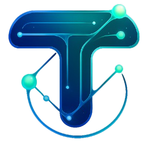

<p align="center">
  <a href="https://teamatonce.com">
    
  </a>
  <h1 align="center">TeamAtOnce</h1>
  <p align="center">
    <strong>Open-source AI-driven development outsourcing platform</strong>
  </p>
  <p align="center">
    Revolutionizing software development outsourcing through intelligent automation, transparent processes, and seamless collaboration.
  </p>
</p>

<p align="center">
  <a href="https://github.com/teamatonce/teamatonce/blob/main/LICENSE"></a>
  <a href="https://github.com/teamatonce/teamatonce/stargazers"></a>
  <a href="https://github.com/teamatonce/teamatonce/issues"></a>
</p>

<p align="center">
  <a href="#quick-start">Quick Start</a> |
  <a href="#features">Features</a> |
  <a href="CONTRIBUTING.md">Contributing</a>
</p>

---

## What is TeamAtOnce?

TeamAtOnce is an open-source AI-driven development outsourcing marketplace that eliminates traditional risks through intelligent automation, AI-powered assessments, escrow payments, and real-time project management.

## Features

### Marketplace
- **Company Profiles** -- Showcase portfolios, team skills, and certifications
- **AI-Powered Matching** -- Intelligent company-to-project matching based on skills and track record
- **Data Engine** -- Web crawling and pipeline for company discovery and enrichment
- **Escrow Payments** -- Secure milestone-based payments via Stripe

### Learning & Certification
- **Course Management** -- Create and manage technical courses with modules and lessons
- **AI Assessments** -- AI-generated quizzes and skill evaluations
- **Certificates** -- Verifiable achievement certificates
- **Learning Paths** -- Structured skill development routes
- **Achievements** -- Gamification with badges and progress tracking

### Collaboration
- **Project Management** -- Track projects with milestones and deliverables
- **Discussion Forums** -- Community discussions and knowledge sharing
- **Real-time Notifications** -- WebSocket-powered live updates
- **Blog** -- Content management for articles and guides
- **Study Groups** -- Collaborative learning spaces

### Platform
- **AI Integration** -- OpenAI-powered content generation and analysis
- **Search** -- Qdrant vector search for semantic content discovery
- **Multi-language** -- i18n support
- **Admin Dashboard** -- Platform administration and analytics
- **SEO** -- Server-side rendering and metadata optimization

## Tech Stack

| Layer | Technology |
|-------|------------|
| **Backend** | NestJS 11, TypeScript, PostgreSQL (raw SQL), Redis, Qdrant, Socket.io |
| **Frontend** | React 19, Vite, TypeScript, Tailwind CSS, Radix UI, Zustand |
| **AI** | OpenAI (GPT-4o-mini, embeddings) |
| **Payments** | Stripe (escrow, subscriptions) |
| **Search** | Qdrant (vector search) |

## Quick Start

```bash
git clone https://github.com/teamatonce/teamatonce.git
cd teamatonce

# Backend
cd backend
cp .env.example .env
npm install
npm run migrate
npm run start:dev

# Frontend (new terminal)
cd frontend
npm install
npm run dev
```

## Project Structure

```
teamatonce/
├── backend/              # NestJS API (34 modules)
│   ├── src/modules/      # auth, company, courses, assessments, ai, search,
│   │                     # escrow, certificates, learning-paths, blog, ...
│   └── migrations/       # PostgreSQL migrations
├── frontend/             # React + Vite + Tailwind
│   └── src/
└── .github/workflows/    # CI/CD
```

## Contributors

Thank you to all the amazing people who have contributed to TeamAtOnce! 🎉

<a href="https://github.com/teamatonce/teamatonce/graphs/contributors">
  
</a>

Want to see your face here? Check out our [Contributing Guide](CONTRIBUTING.md) and start contributing today!

## Project Activity

<p align="center">
  
  
  
  
</p>

## Security

Please report security vulnerabilities responsibly. See [SECURITY.md](SECURITY.md).

## License

This project is licensed under the [Apache License 2.0](LICENSE).

Copyright 2025 TeamAtOnce Contributors.
